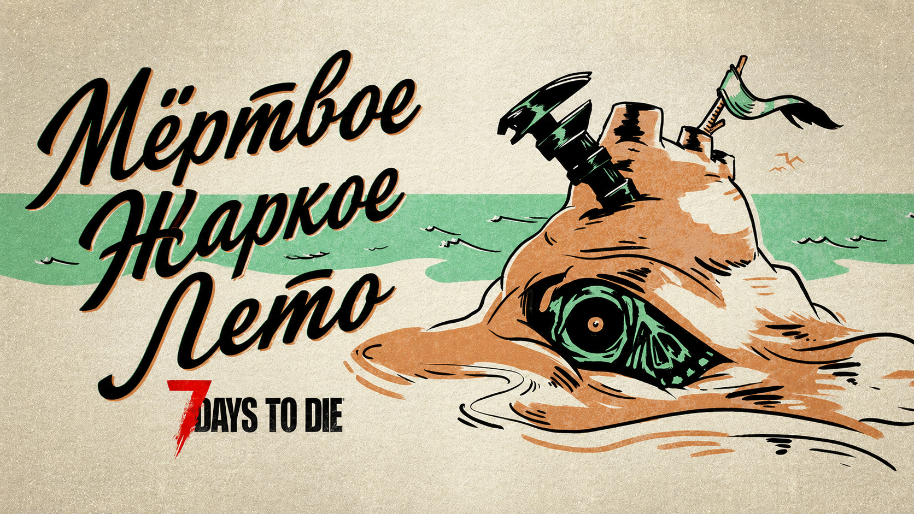

### ***Примечание: Экспериментальная сборка V3.0 (EXP) будет доступна для загрузки в понедельник, 15 июня***.

**Описание обновления V3.0 «Мертвое Жаркое Лето»**

Апокалипсис стал еще жарче. Посреди хаоса «Мертвого Жаркого Лета» мы рады представить это масштабное системное обновление. Построенная вокруг ключевой философии свободы действий игрока, версия 3.0 дает выжившим как никогда много свободы в том, чтобы формировать апокалипсис по своему усмотрению.

Версия 3.0 представляет 150 настроек песочницы, предоставляя игрокам больший контроль над их опытом выживания. Выжившие могут детально настраивать широкий спектр параметров, чтобы сделать акцент на тех аспектах игры, которые им нравятся больше всего, или уменьшить (и даже отключить) системы, которых они предпочитают избегать, с целью позволить игрокам создать тот опыт выживания, который они хотят. Пользовательскими пресетами также можно делиться с другими, и мы создали подборку собственных специальных режимов для игроков.

Ежедневное выживание расширено благодаря введению системы Магнитуды предметов (Item Magnitude) — новой механики, которая меняет масштаб характеристик оружия и снаряжения, наряду с опциональными настройками Починки и Износа, благодаря которым каждая битва оставляет долгосрочные последствия. Вместе эти системы делают добычу более разнообразной, значимой и стоящей усилий, добавляя большую глубину прогрессии и распределению предметов.

Сам мир также эволюционировал. Полная переработка вывесок локаций (POI), работающая на новой системе Sign-Tech, добавляет сотни новых элементов окружения в города, комплексы, предприятия и руины, улучшая атмосферу, читаемость и погружение на просторах пустоши.

Наряду с этими обновлениями, Версия 3.0 предлагает переработанное главное меню, более 60 новых локаций (POI) и настраиваемую систему прицела. Новый косметический костюм также будет доступен с выходом стабильной версии V3.0.

Вас ждет новый выжженный сезон выживания. Читайте дальше, чтобы узнать больше:

---

## **Возьмите Песочницу Под Свой Контроль**

* Наступает Новая Эра Контроля. Обновление V3.0 «Мертвое Жаркое Лето» превращает игру в ультимативный симулятор выживания со 150 настройками песочницы. Будь то повторное переживание напряжения классических стилей игры без журналов, отключение копания зомби, погружение в совершенно новый официальный пресет вроде «Undead Matinee» или создание полностью собственных миров через пользовательские пресеты — теперь власть определять правила выживания полностью в ваших руках!
* Ваши Правила. Ваш Мир. Ваша История Выживания. V3.0 вводит полное создание пресетов песочницы и обмен ими, что позволяет игрокам создавать персонализированные варианты выживания, как никогда раньше. Называйте свои творения, настраивайте каждую деталь и открывайте безграничные игровые вариации, полностью соответствующие вашему видению апокалипсиса.

Вместе с классическими пресетами сложности, V3.0 включает в себя совершенно новые Официальные Пресеты:

* **Undead Matinee**: Режим, вдохновленный старыми фильмами, с упором на ближний бой, более медленными зомби, огромными толпами и нехваткой боеприпасов (включает новую настройку добивания в голову).
* **Madmole’s Mayhem**: Меньше припасов и более суровые штрафы, включая новую потерю предметов и прочности снаряжения при смерти, а также постоянное давление (Безумие Мэдмола... звучит отлично!).
* **Almost Creative Mode**: Апокалипсис, но без самого апокалипсиса (Потому что умирать — это неудобно).
* **Bite Club**: Хардкорный режим с перманентной смертью — возрождения только для трусов, поэтому у вас осталась всего одна жизнь; используйте ее с умом.
* **Legacy Survival**: Олдскульное выживание с современными последствиями (играйте, как будто на дворе 2014 год).
* **7 Days Later**: Современный режим, вдохновленный кино, с хаотичными ордами быстро движущихся зомби.
* **Caveman’s Life**: Выживайте в апокалипсисе, где лучшими инструментами являются палки.
* **Dumpster Diver**: Превращение мусора в величие (Это не барахольство, если вы пускаете это в дело).
* **Dying World**: Ресурсы исчезают, и вы не сильно от них отстаете.
* **Disaster Film**: Катастрофы накапливаются быстрее, чем вы успеваете с ними справляться.
* **Chibi Mode**: Они не только милые... но еще и быстрые! (Хорошо, что у вас тоже есть своя скорость).

Информацию о конфигурациях серверов для Песочницы, совместимости сохранений с серверами версии V2.6 и полный список всех настроек Песочницы можно найти в соответствующих разделах ниже.

---

## **Гонка Вооружений Начинается с Магнитуды**

Новые мощные варианты Магнитуды (Magnitude) меняют облик выживания в версии 3.0, принося улучшенные характеристики для найденного оружия, инструментов, модификаций рабочих станций и многого другого. Оранжевая звезда будет выделять особые характеристики вместе с процентом бирюзового цвета. Вы можете найти кирку с повышенным уроном по блокам, дробовик с увеличенной дальностью, мачете с повышенным уроном или кастрюлю с ускоренным временем готовки — комбинации бесконечны!

* Все инструменты и оружие имеют шанс получить улучшенные характеристики при нахождении в добыче.
* Инструменты и оружие все еще могут иметь случайные характеристики и бирюзовые проценты, но они не считаются улучшенными, пока характеристика не отмечена оранжевым цветом (это позволяет объединенным предметам переходить в диапазон улучшенных).
* Широкий спектр модификаций для брони, инструментов, транспорта, оружия и рабочих станций теперь будет иметь прогрессивные уровни качества.
* Модификации более высокого качества дают более сильные бонусы (например, модификация «Могильщик» 1-го качества добавляет 5% урона по земле, а версия 6-го качества — 30%).
* Не каждая модификация выигрывает от более высокого качества (моды с простыми эффектами включения/выключения, такие как фонарик на шлем, по-прежнему ограничены одной версией).

Выжившие теперь могут использовать новую Станцию Комбинирования (Combine Station), чтобы объединять атрибуты похожих предметов для постепенного увеличения их мощности до максимума. Она также предоставляет альтернативный метод ремонта. Торговцы теперь будут продавать экипировку, улучшенную Магнитудой (например, оружие с особыми усиленными характеристиками), что создает новую высокоуровневую экономику для серьезных выживших.

* Самые высокие процентные характеристики будут перенесены на объединенный предмет независимо от его качества.
* Если усиленная характеристика предмета 1-го качества показывает 20%, то при объединении с предметом 6-го качества она окажет большее влияние на более высокую базовую характеристику предмета 6-го качества.

Благодаря различным доступным вариантам износа и ремонта, игроки теперь могут выбирать, насколько суровым будет влияние апокалипсиса на предметы.

* Варианты методов ремонта включают: без ремонта, только ремкомплекты, ремонт комбинированием или использование и ремкомплектов, и комбинирования.
* Перманентный Износ при Ремонте можно установить на 5, 10, 15, 20 или 25% от максимальной прочности предмета за каждый ремонт (первый ремонт бесплатен).
* Износ при Смерти позволяет игрокам выбирать, сколько прочности предметы потеряют при смерти, вплоть до перманентной потери максимальной прочности.
* Добавлена новая турель M60, чтобы помочь с ордами на поздних этапах игры (использует все типы патронов 7.62).

---

## **Знамения Конца Времен**

* Полная переработка вывесок локаций (POI) появляется в версии 3.0 благодаря новой системе Sign-Tech, которая добавляет тысячи вывесок в игровые локации. Это привносит более богатую атмосферу и глубокое погружение в каждый уголок мира. Улицы, магазины, базы и руины теперь украшены значительно улучшенными вывесками, созданными для того, чтобы пустошь казалась аутентичной, цельной и живой. Создатели локаций получат доступ к инструментам Sign-Tech через редактор уровней прямо на релизе.
* Доступны холсты и декали (Canvas & Decal) различных размеров (например, 1x1, 2x2, 3x3 и т.д.).
* Можно добавлять текст, фигуры и шум.
* Присутствует палитра цветов RGBA.
* Доступна маскировка слоев (Только Цвет, Цвет и Маска, Только Маска, Вырезание).
* Доступно искажение слоев (Наклон, Сжатие/Выпуклость, Закручивание, Калейдоскоп, Перспектива, Дуга, Растяжение, Сетка).

---

## **Локации (POI)**

* Более 60 новых локаций (POI), добавляющих миру глубину и разнообразие.
* 5 тир – «Champions Coliseum» (soccer_stadium_01).
* 4 тир – «Granddaddy’s Cable Regional Service Center» (industrial_60_01).
* 4 тир – «Ironwood Paper Mill» (industrial_60_02).
* 4 тир – «Beanthere Coffee Company» (industrial_60_03).
* 4 тир – «ChemTech Distribution Center» (industrial_60_04).
* 4 тир – «Water Treatment Plant» (industrial_strip_06).
* 4 тир – «Camp Hollow Point» (army_camp_09).
* 4 тир – «Green Hill» (army_camp_10).
* 4 тир – «McOivey Farms» (farm_18).
* 4 тир – «Sprout & Sons Nursery» (farm_20).
* 2 новых варианта генерации (RWG), добавляющих больше возможностей для появления коммерческих и индустриальных локаций размером 100x100.

---

## **Свежий Интерфейс для Жестокого Мира**

* Выживших встретит переработанный пользовательский интерфейс главного меню с обновленным визуалом, улучшенной презентацией и более мрачной постапокалиптической эстетикой. Хотя внешний интерфейс вступил в новую эру в V3.0, полная переработка внутриигрового интерфейса ожидается в будущем релизе.

---

## **В Вашем Прицеле**

* Выжившие теперь имеют полный контроль над видимостью в бою благодаря новой настраиваемой системе прицела. Изменяйте масштаб, непрозрачность и цвет прицела в соответствии с вашим личным стилем игры, а расширенные настройки отображения позволят вам точно решить, когда и как появляется перекрестие. Все новые параметры настройки можно найти на специальной вкладке «Прицел» (Crosshair) в меню общих настроек.

---

## **Солнце Вышло, Пушки К Бою!**

* Новое косметическое дополнение (DLC) «Набор пляжной одежды» привносит тропический хаос в апокалипсис благодаря стильным новым нарядам, созданным для выживших, которые отказываются позволять краху цивилизации разрушить их летние планы. От песчаных берегов до залитых кровью набережных — пустошь еще никогда не выглядела такой расслабляющей. И помните: когда наступает конец света, начинается загар!

---

## **Моддинг**

* Код WebDashboard был интегрирован с основным кодом игры, что означает, что он всегда будет актуальным.
* Для модов есть только два изменения: вам больше не нужно ссылаться на дополнительные сборки, а только на основную библиотеку игры `Assembly-CSharp.dll`, и из-за того, что код проходит через процесс опубличивания (publicizer), вам может потребоваться адаптировать часть вашего кода, переопределяющего ванильные методы, чтобы он также был публичным.
* Файл `Localization.txt` был переименован в `Localization.csv`, чтобы правильно указать его содержимое и облегчить его открытие с помощью электронных таблиц.
* Формат `entitygroups.xml` возвращен к правильным элементам XML (предыдущий текстовый формат в настоящее время все еще поддерживается для обратной совместимости).
* Фреймворк XUi получил масштабную внутреннюю переработку и очистку кода. Новая система привязки переносит больше контроля из кода в XML (Документацию можно найти на официальной Wiki).
* Сильно переработаны представления XUi (views) для уменьшения дублирования кода, обеспечения более общих функций (атрибутов) для разных типов представлений и повышения совместимости. Например, таблицы и сетки имеют более похожие имена атрибутов, а имена привязок окон и точки поворота представлений используют одинаковые значения.
* Удалены ненужные атрибуты представлений: прямоугольники (rects) теперь всегда имеют базовый виджет UI, а панели — панель UI. Прямоугольники следует использовать вместо панелей везде, где это возможно.
* Добавлены новые представления: video (видео), scrollbar (полоса прокрутки) и scrollview (область прокрутки).
* Удален атрибут `force_hide`, видимость теперь корректно обрабатывается на каждом элементе представления через стандартный атрибут `visible`.
* Анимациями (Tweens) можно управлять из XML.
* Папка `XUi` переименована в `XUi_InGame`, чтобы было понятнее, для чего предназначена каждая папка.
* Файл `controls.xml` переименован в `templates.xml`, чтобы избавиться от путаницы между шаблонами XML и классами контроллеров XUi.
* Из файла `xui.xml` удален неиспользуемый уровень элемента XML `ruleset`.
* Добавлена поддержка использования шаблонов в качестве окон.
* Произведено множество мелких исправлений ошибок в различных частях представлений, контроллеров и самого фреймворка в целом.

---

## **Настройки Песочницы**

Ниже представлен полный список из 150 настроек песочницы в нашем обновлении «Мертвое Жаркое Лето». Каждая настройка включает как минимум две уникальные переменные, что приводит к миллиардам возможных комбинаций пресетов игровых режимов во Вселенной 7 Days. Полный список выглядит следующим образом:

### **Настройки Игрока (Player Settings)**

* Ranged Damage (Урон дальнего боя)
* Melee Damage (Урон ближнего боя)
* Block Damage (Урон по блокам)
* Terrain Damage (Урон по местности)
* Headshot Multiplier (Множитель выстрела в голову)
* Player Damage In (Входящий урон по игроку)
* Walk Speed (Скорость ходьбы)
* Run Speed (Скорость бега)
* Crouch Speed (Скорость в приседе)
* Jump Strength (Сила прыжка)
* Stamina Regen (Регенерация выносливости)
* Stamina Usage (Использование выносливости)
* XP Multiplier (Множитель опыта)
* Show XP (Отображение опыта)
* Level Stat Bonus (Бонус характеристик за уровень)
* Skill Gain Rate (Скорость получения навыков)
* Skill Gain Amount (Количество получаемых навыков)
* Death Penalty (Штраф за смерть)
* Lose On Death (Потеря при смерти)
* Death Loss Count (Количество потерь при смерти)
* Death Degradation (Износ при смерти)
* Death Degradation Amount (Степень износа при смерти)
* Drop On Death (Выпадение предметов при смерти)
* Drop On Quit (Выпадение предметов при выходе)
* Infection Rate (Скорость заражения)
* New Player Buff (Бафф нового игрока)
* Encumbrance Slots (Слоты перегруза)
* Jar Refund (Возврат банок)

### **Настройки Сущностей (Entity Settings)**

* Enemy Spawning (Появление врагов)
* Max Enemy Tier (Максимальный тир врагов)
* Enemy Density (Плотность врагов)
* Enemy Respawn (Возрождение врагов)
* Biome Animal Respawn (Возрождение животных в биоме)
* Enemy Damage Dealt (Урон, наносимый врами)
* Entity Damage In (Входящий урон по сущностям)
* Enemy Block Damage (Урон по блокам от врагов)
* BM Block Damage (Урон по блокам в Кровавую Луну)
* Headshot Mode (Режим выстрелов в голову)
* Entity Health Bars (Полосы здоровья сущностей)
* Show Entity Damage (Отображение урона по сущностям)
* Zombie Day Speed (Скорость зомби днем)
* Zombie Night Speed (Скорость зомби ночью)
* Zombie Feral Speed (Скорость диких зомби)
* Zombie BM Speed (Скорость зомби в Кровавую Луну)
* Zombie Feral Sense (Чутье диких зомби)
* AI Smell Mode (Режим обоняния ИИ)
* Zombie Rage (Ярость зомби)
* Zombie Digging (Копание зомби)
* Zombies Eat Animals (Зомби едят животных)

### **Настройки Мира (World Settings)**

* Global Game Stage (Глобальная стадия игры)
* Biome Game Stage (Стадия игры в биоме)
* Biome Progression (Прогрессия биома)
* Temperature Survival (Выживание при температуре)
* Max Tech Type (Максимальный тип технологий)
* Workstations in the Wild (Рабочие станции в дикой природе)
* Blood Moon Frequency (Частота Кровавой Луны)
* Blood Moon Range (Разброс дней Кровавой Луны)
* Blood Moon Count (Количество врагов в Кровавую Луну)
* Blood Moon Warning (Предупреждение о Кровавой Луне)
* Air Drops (Воздушные грузы)
* Air Drop Variance (Дисперсия воздушных грузов)
* Storm Frequency (Частота штормов)
* Storm Warning (Предупреждение о шторме)
* Heat Map Sensitivity (Чувствительность тепловой карты)
* 24 Day Cycle (24-часовой цикл)
* Daylight Length (Продолжительность светового дня)
* Mark Air Drops (Отметки на воздушных грузах)
* Allow Map (Разрешить карту)
* Allow Compass (Разрешить компас)
* Allow Screen Markers (Разрешить маркеры на экране)
* Show Location Info (Показать информацию о местоположении)
* Show Day/Time (Показать день/время)

### **Настройки Ресурсов (Resource Settings)**

* Max Loot Tier (Максимальный тир добычи)
* Global Loot Stage (Глобальная стадия добычи)
* Biome Loot Stage (Стадия добычи в биоме)
* POI Loot Stage (Стадия добычи в локациях)
* Loot Respawn Days (Дни до возрождения добычи)
* Loot Timer (Таймер добычи)
* Loot Bag Drop (Выпадение сумок с добычей)
* Loot Abundance (Обилие добычи)
* Food Abundance (Обилие еды)
* Drink Abundance (Обилие напитков)
* Medical Abundance (Обилие медикаментов)
* Ammo Abundance (Обилие боеприпасов)
* Resource Abundance (Обилие ресурсов)
* Armor Abundance (Обилие брони)
* Melee Abundance (Обилие оружия ближнего боя)
* Ranged Abundance (Обилие оружия дальнего боя)
* Currency Abundance (Обилие валюты)
* Magazine Abundance (Обилие журналов)
* Treasure Map Chance (Шанс выпадения карты сокровищ)
* Mining Yield (Урожайность добычи ископаемых)
* Crop Yield (Урожайность сельскохозяйственных культур)
* Seed Drop (Выпадение семян)
* Resource Yield (Выход ресурсов)
* Crop Growth (Рост сельскохозяйственных культур)

### **Настройки Крафта (Crafting Settings)**

* Crafting Progression (Прогрессия крафта)
* Crafting Max Tier (Максимальный тир крафта)
* Magazine Progress (Прогресс через журналы)
* Backpack Crafting (Крафт в рюкзаке)
* Workstation Crafting (Крафт на рабочих станциях)
* Smelter Type (Тип плавильни)
* Crafting Timer (Таймер крафта)
* Crafting Cost (Стоимость крафта)
* Crafting Yield (Выход крафта)
* Scrapping Yield (Выход при разборке)
* Dew Collector Time (Время работы сборщика росы)
* Dew Collector Yield (Производительность сборщика росы)
* Dew Collector Input (Входные ресурсы сборщика росы)
* Apiary Time (Время работы пасеки)
* Apiary Yield (Производительность пасеки)
* Apiary Input (Входные ресурсы пасеки)
* Item Degradation (Износ предметов)
* Repair Method (Метод ремонта)
* Repair Degradation (Износ при ремонте)

### **Торговцы (Traders)**

* Trading Enabled (Торговля включена)
* Vending Enabled (Торговые автоматы включены)
* Trader Hours (Часы работы торговца)
* Trader Protection (Защита торговца)
* Trading Dialog (Диалог с торговцем)
* Global Trader Stage (Глобальная стадия торговцев)
* Trader Max Tier (Максимальный тир торговца)
* Trader Item Count (Количество предметов у торговца)
* Vending Item Count (Количество предметов в автоматах)
* Trader Reset (Сброс ассортимента торговца)
* Vending Reset (Сброс ассортимента автоматов)
* Sell Price (Цена продажи)
* Buy Price (Цена покупки)
* Trader Buy Limit (Лимит покупок у торговца)

### **Настройки Задач (Task Settings)**

* Challenges (Испытания)
* Quests (Квесты)
* Intro Challenges (Вступительные испытания)
* Intro Quest (Вступительный квест)
* Trade Routes (Торговые маршруты)
* Buried Quests (Квесты на поиск закопанного)
* POI Quests (Квесты в локациях)
* Quests per Tier (Квесты на каждый тир)
* Quests per Day (Квесты в день)
* Base Skill Points (Базовые очки навыков)

### **Прочие Настройки (Miscellaneous Settings)**

* Vehicle Fuel Usage (Расход топлива транспортом)
* Vehicle Entity Damage (Урон сущностям от транспорта)
* Vehicle Block Damage (Урон блокам от транспорта)
* Vehicle Self Damage (Урон по самому транспорту)
* Electrical Output (Выход электроэнергии)
* Celebrate Kills (Празднование убийств)
* Big Heads (Большие головы)
* Tiny Zombies (Крошечные зомби)
* Gravity (Гравитация)
* Silly Sounds (Глупые звуки)
* Black and White (Черно-белый режим)

---

## **Заметки для Администраторов Серверов: Настройки Песочницы и удаление устаревших параметров**

* В связи с добавлением более 150 Настроек Песочницы (Sandbox Options), некоторые устаревшие параметры, ранее задававшиеся в `serverconfig.xml`, были перенесены в новое XML-свойство `SandboxCode`.
* Администраторам серверов, которые хотят продолжить использовать сохранения с версии V2.6, необходимо будет воссоздать свои устаревшие настройки из `serverconfig.xml`, используя внутриигровое меню Настроек Песочницы.
* Скопируйте код, а затем вставьте его в качестве значения свойства `SandboxCode` в обновленный файл `serverconfig.xml` версии 3.0.
* Хотя мы сделали все возможное, чтобы связаться с провайдерами серверов, вам может потребоваться обратиться к вашему конкретному провайдеру для помощи в настройке этих параметров.
* Название и значение по умолчанию для нового свойства: `<property name="SandboxCode" value="AAAJABJACJADJARFBNC"/>`.
* Указанный выше `SandboxCode` является эквивалентом устаревшей настройки `GameDifficulty` по умолчанию, соответствующей уровню "Adventurer" (Искатель приключений) или 1.

Ниже приведен список устаревших свойств, которые были удалены или преобразованы:

* GameDifficulty
* BlockDamagePlayer
* BlockDamageAI
* BlockDamageAIBM
* XPMultiplier
* DayNightLength
* DayLightLength
* BiomeProgression
* StormFreq
* DeathPenalty
* DropOnDeath
* DropOnQuit
* JarRefund
* EnemySpawnMode
* EnemyDifficulty
* ZombieFeralSense
* ZombieMove
* ZombieMoveNight
* ZombieFeralMove
* ZombieBMMove
* AISmellMode
* BloodMoonFrequency
* BloodMoonRange
* BloodMoonWarning
* BloodMoonEnemyCount
* LootAbundance
* LootRespawnDays
* AirDropFrequency
* AirDropMarker
* QuestProgressionDailyLimit